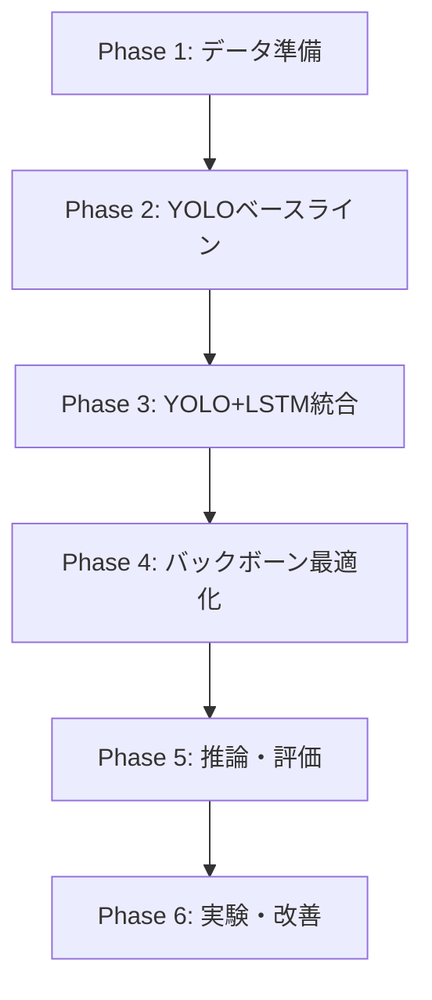

## 進捗

---

## 2段階学習アプローチの詳細メモ (2025/10/19)

### 概要

YOLO+LSTMモデルは**2段階学習**で構築します:
1. **Phase 1**: YOLOをスライス単位で学習 (全スライス独立)
2. **Phase 2**: LSTMを椎体単位で学習 (YOLOは固定 or ファインチューニング)

---

## Phase 1: YOLO事前学習

### 目的
スライスレベルの骨折検出器を作成

### データ構成
```python
# 全スライスを独立サンプルとして扱う
Dataset = [
    # 患者1
    (inp1003/vertebra_27/slice_000.nii, bbox_label_000.txt),
    (inp1003/vertebra_27/slice_001.nii, bbox_label_001.txt),
    ...
    (inp1003/vertebra_40/slice_099.nii, bbox_label_099.txt),

    # 患者2
    (inp1039/vertebra_27/slice_000.nii, bbox_label_000.txt),
    ...
]

# 推定サンプル数: 38症例 × 14椎体/症例 × 70スライス/椎体 ≈ 37,000サンプル
```

### 患者レベル分割 (5-fold CV)
```python
fold_0:
  train: [inp1003, inp1039, ..., inp1078]  # 30症例
  val:   [inp1059, ..., inp1088]           # 8症例

# 重要: 同じ患者のスライスが train/val に跨がらないこと！
```

### データローダー実装例
```python
class YOLOSliceDataset(Dataset):
    def __init__(self, slice_paths, label_paths, augmentation=True):
        self.slice_paths = slice_paths  # 全スライスのパスリスト
        self.label_paths = label_paths  # 対応するYOLOラベル
        self.augmentation = augmentation

    def __len__(self):
        return len(self.slice_paths)

    def __getitem__(self, idx):
        # 1サンプル = 1枚のスライス画像
        image = load_nifti(self.slice_paths[idx])  # [H, W]
        bboxes = load_yolo_label(self.label_paths[idx])  # [[cls, x, y, w, h], ...]

        if self.augmentation:
            image, bboxes = augment(image, bboxes)  # 回転、反転、明度調整

        image = normalize(image)  # [0, 1] or [-1, 1]
        image = to_tensor(image).unsqueeze(0)  # [1, H, W]

        return {
            'image': image,
            'bboxes': bboxes,
            'path': self.slice_paths[idx]
        }
```

### 学習設定
```yaml
data:
  batch_size: 32  # スライス単位
  image_size: [256, 256]
  num_workers: 4

model:
  backbone: cspdarknet  # yolov8n
  pretrained: true
  num_classes: 1  # 骨折クラスのみ (二値分類)

training:
  epochs: 100
  optimizer: AdamW
  lr: 0.001
  scheduler: CosineAnnealingLR
  early_stopping_patience: 15
```

### 学習タスク
- BBox Regression Loss (IoU Loss or GIoU Loss)
- Classification Loss (Focal Loss for 不均衡対策)
- Objectness Loss

### 評価 (この段階)
- **スライスレベル**: mAP@0.5, mAP@0.5:0.95, Precision, Recall
- **椎体レベル (簡易版)**: 各椎体の全スライスで多数決
  - 例: vertebra_27の70スライス中、30スライスで骨折検出 → 骨折あり

### 出力
- 学習済みYOLOモデル: `yolo_baseline.pth`
- ベースライン性能の確認 (LSTM無し)

---

## Phase 2: LSTM学習

### 目的
椎体レベルの骨折分類器を作成 (時系列統合)

### データ構成
```python
# 椎体単位でグループ化
Dataset = [
    # 患者1の椎体1
    {
        'slices': [vertebra_27/slice_000.nii, ..., slice_069.nii],  # 70枚
        'label': 1  # 骨折あり
    },
    # 患者1の椎体2
    {
        'slices': [vertebra_28/slice_000.nii, ..., slice_065.nii],  # 66枚 → 70枚にパディング
        'label': 0  # 骨折なし
    },
    ...
]

# 推定サンプル数: 38症例 × 14椎体/症例 ≈ 532サンプル
```

### データローダー実装例
```python
class LSTMVertebraeDataset(Dataset):
    def __init__(self, vertebra_list, max_slices=70, sampling='center_crop', padding='replicate'):
        self.vertebra_list = vertebra_list  # [(vertebra_path, label), ...]
        self.max_slices = max_slices
        self.sampling = sampling
        self.padding = padding

    def __len__(self):
        return len(self.vertebra_list)

    def __getitem__(self, idx):
        vertebra_path, label = self.vertebra_list[idx]
        slices = sorted(glob(f"{vertebra_path}/slice_*.nii"))

        # 固定長に調整
        slices = self.adjust_length(slices, self.max_slices)

        # 全スライスを読み込み
        images = []
        for slice_path in slices:
            img = load_nifti(slice_path)
            img = normalize(img)
            images.append(to_tensor(img).unsqueeze(0))  # [1, H, W]

        images = torch.stack(images)  # [N_slices, 1, H, W]

        return {
            'images': images,        # [70, 1, 256, 256]
            'label': label,          # 0 or 1
            'vertebra_path': vertebra_path
        }

    def adjust_length(self, slices, target_len):
        """可変長 → 固定長変換"""
        n = len(slices)

        if n > target_len:
            # サンプリング
            if self.sampling == 'center_crop':
                # 中心部を優先 (骨折は椎体中心に多い)
                start = (n - target_len) // 2
                return slices[start:start + target_len]
            elif self.sampling == 'uniform_sample':
                # 均等間隔サンプリング
                indices = np.linspace(0, n-1, target_len, dtype=int)
                return [slices[i] for i in indices]

        elif n < target_len:
            # パディング
            if self.padding == 'replicate':
                # 最終スライスを複製
                return slices + [slices[-1]] * (target_len - n)
            elif self.padding == 'zero':
                # ゼロ画像を追加
                return slices + ['zero'] * (target_len - n)

        return slices
```

### モデル構成
```python
class YOLOLSTMModel(nn.Module):
    def __init__(self, yolo_checkpoint, freeze_yolo=True):
        super().__init__()

        # 学習済みYOLOをロード
        self.yolo = load_pretrained_yolo(yolo_checkpoint)

        # YOLOの重みを固定
        if freeze_yolo:
            for param in self.yolo.parameters():
                param.requires_grad = False
            self.yolo.eval()  # BNを凍結

        # LSTM層
        self.lstm = nn.LSTM(
            input_size=256,      # YOLOの特徴次元
            hidden_size=256,
            num_layers=2,
            batch_first=True,
            dropout=0.3
        )

        # 分類器
        self.classifier = nn.Sequential(
            nn.Linear(256, 128),
            nn.ReLU(),
            nn.Dropout(0.3),
            nn.Linear(128, 2)  # 骨折/非骨折
        )

    def forward(self, sequence):
        """
        Args:
            sequence: [Batch, N_slices, C, H, W] (例: [4, 70, 1, 256, 256])

        Returns:
            logits: [Batch, 2]
        """
        batch_size, seq_len = sequence.shape[:2]

        # 各スライスをYOLOで特徴抽出
        features = []
        for t in range(seq_len):
            with torch.no_grad() if self.freeze_yolo else torch.enable_grad():
                feat = self.yolo.extract_features(sequence[:, t])  # [Batch, 256]
            features.append(feat)

        features = torch.stack(features, dim=1)  # [Batch, N_slices, 256]

        # LSTM処理
        lstm_out, (h_n, c_n) = self.lstm(features)  # lstm_out: [Batch, N_slices, 256]

        # 最終出力を使用 (または全時刻の平均)
        final_feat = lstm_out[:, -1, :]  # [Batch, 256]
        # または: final_feat = lstm_out.mean(dim=1)

        # 分類
        logits = self.classifier(final_feat)  # [Batch, 2]

        return logits
```

### 学習設定
```yaml
data:
  batch_size: 4  # 椎体単位 (メモリ消費大)
  max_slices_per_vertebra: 70
  sampling_strategy: center_crop
  padding_mode: replicate

model:
  freeze_yolo: true
  lstm:
    hidden_dim: 256
    num_layers: 2
    dropout: 0.3

training:
  epochs: 50
  optimizer: AdamW
  lr: 0.001  # LSTMと分類器の学習率
  scheduler: ReduceLROnPlateau
  early_stopping_patience: 10
```

### 損失関数
```python
# 椎体レベルのクロスエントロピー損失
criterion = nn.CrossEntropyLoss(weight=class_weights)  # 不均衡対策

# または Focal Loss
from torchvision.ops import focal_loss
loss = focal_loss.sigmoid_focal_loss(logits, labels, alpha=0.25, gamma=2.0)
```

### 評価 (この段階)
- **椎体レベル**: Accuracy, Precision, Recall, F1, AUC
- **比較評価**:
  - YOLO単体 (Phase 1の多数決) vs YOLO+LSTM
  - LSTMの効果を定量化

### 出力
- 学習済みYOLO+LSTMモデル: `yolo_lstm.pth`

---

## 重要な注意点

### 1. 患者レベル分割の厳守
```python
# NG例: 同じ患者がtrain/valに混在
train_slices = [
    'inp1003/vertebra_27/slice_000.nii',
    'inp1003/vertebra_27/slice_001.nii',
    ...
]
val_slices = [
    'inp1003/vertebra_28/slice_000.nii',  # ← inp1003が重複！
    ...
]

# OK例: 患者を完全に分離
fold_0_train_patients = ['inp1003', 'inp1039', ...]
fold_0_val_patients = ['inp1059', 'inp1078', ...]  # 重複なし
```

### 2. YOLOの重み管理
```python
# Phase 2でYOLOを固定する場合
for param in yolo_model.parameters():
    param.requires_grad = False
yolo_model.eval()  # BatchNormの統計も固定

# ファインチューニングする場合
optimizer = Adam([
    {'params': yolo_model.parameters(), 'lr': 1e-5},  # 低学習率
    {'params': lstm_model.parameters(), 'lr': 1e-3}   # 通常学習率
])
```

### 3. メモリ管理
```python
# LSTM学習時のバッチサイズは小さくする
# [4, 70, 1, 256, 256] ≈ 180MB/バッチ → GPU メモリに注意

# メモリ不足の場合:
# - batch_size を 2 に削減
# - max_slices を 50 に削減
# - gradient_accumulation_steps を使用
```

### 4. データ拡張
```python
# YOLO学習時: 積極的なデータ拡張
augmentation = A.Compose([
    A.Rotate(limit=15),
    A.HorizontalFlip(p=0.5),
    A.RandomBrightnessContrast(p=0.3),
], bbox_params=A.BboxParams(format='yolo'))

# LSTM学習時: 軽度のデータ拡張のみ
# (時系列の一貫性を保つため)
augmentation = A.Compose([
    A.RandomBrightnessContrast(p=0.2),
])
```

---

## アブレーション実験計画

### 実験1: LSTM有無の比較
- exp_001: YOLO単体 (Phase 1) → 多数決
- exp_002: YOLO + LSTM (Phase 2)

### 実験2: スライス数の最適化
- exp_003: max_slices=50
- exp_004: max_slices=70 (推奨)
- exp_005: max_slices=100

### 実験3: サンプリング戦略
- exp_006: center_crop (推奨)
- exp_007: uniform_sample
- exp_008: full (パディングなし、可変長)

### 実験4: バックボーン比較
- exp_009: CSPDarknet (yolov8n)
- exp_010: EfficientNet-B0
- exp_011: EfficientNet-B1
- exp_012: ResNet-50

### 実験5: ファインチューニング
- exp_013: freeze_yolo=true (推奨)
- exp_014: freeze_yolo=false (エンドツーエンド)

---

## まとめ

**2段階学習のメリット:**
1. ✅ 段階的検証が可能 (YOLO → LSTM)
2. ✅ 少数データに強い (事前学習済みYOLO活用)
3. ✅ 解釈性が高い (各段階の性能を確認可能)
4. ✅ メモリ効率が良い (YOLO固定時)

**次のステップ:**
- Step A-1: YOLO形式アノテーション作成から開始

---

## 実装計画 (Implementation Roadmap)

### 最終更新: 2025/10/19

本ドキュメントは、YOLOv8+LSTM骨折検出システムの具体的な実装手順をフェーズごとに整理したものです。
[knowledge.md](knowledge.md)の設計方針と[improvements.md](improvements.md)のデータ仕様に基づいています。

---

## **全体実装フロー (6フェーズ)**



---

### **Phase 1: データ準備** 🔧

**目標**: スライス画像からYOLO形式データセットを作成し、連続スライス用DataLoaderを実装

#### **1-1. YOLO形式変換スクリプト** (`data_preparing/convert_to_yolo.py`)

**入力データ構造**:
```
data/slice_train/
├── axial/
│    ├── {case_id}/           # 例: inp1003
│    |     └── {vertebra_id}/   # 例: 27, 28, ...
│    |           └── slice_*.nii  # 各スライス画像
|    └── fracture_labels_*.csv  # その症例のスライスパスと情報
└── axial_mask/
     ├── {case_id}/
     |     └── {vertebra_id}/
     |           └── slice_*.nii  # マスク(値0-6: 0=背景, 1-6=骨折インスタンス)
     └── mask_labels_*.csv
                 

**出力データ構造**:
```
data/yolo_format/
├── images/
|    └── axial/
│         ├── train/
│              └── {case}_{vertebra}_{slice}.png  # 例: inp1003_27_slice_005.png
└── labels/
     └── axail/
          ├── train/
               └── {case}_{vertebra}_{slice}.txt  # YOLO形式アノテーション
                  # 内容例 (1スライスに複数骨折がある場合は複数行):
                  # 0 0.573 0.384 0.089 0.052
                  # 0 0.536 0.531 0.065 0.048
```

**実装機能**:

```python
# 擬似コード
def convert_to_yolo_format():
    """
    マスク画像からYOLO形式BBoxを抽出
    """
    for case_id in patient_list:
        for vertebra_id in vertebra_list:
            for slice_file in slice_files:
                # 1. マスク読み込み
                mask = load_nifti(mask_path)

                # 2. マルチインスタンスBBox抽出 (値1-6をループ)
                bboxes = []
                for mask_value in range(1, 7):
                    if (mask == mask_value).any():
                        bbox = extract_bbox(mask, mask_value)
                        if is_valid_bbox(bbox):  # 品質チェック
                            bboxes.append(bbox)

                # 3. 画像をPNG保存 (256x256にゼロパディング)
                image = load_nifti(image_path)
                image_padded = zero_pad_to_256(image)
                save_png(image_padded, output_image_path)

                # 4. YOLO形式テキスト保存
                save_yolo_labels(bboxes, output_label_path)

    # 5. train/val分割 (患者レベル5-fold)
    create_patient_level_splits()
```

**BBox品質チェック**:
- 最小面積: 50px²以上
- 正規化座標範囲: [0, 1]
- アスペクト比: 1:20未満

**患者レベル5-fold分割**:
```python
# 患者ID → fold番号のマッピング
# データリーケージ防止: 同一患者のすべての椎体・スライスは同じfoldに配置
patient_folds = {
    'inp1003': 0,
    'inp1010': 0,
    'inp1012': 1,
    ...
}
```

**実装ファイル**:
- `vertebrae_YOLO/data_preparing/convert_to_yolo.py`
- 設定: `run/conf/data_preparing.yaml`

**検証項目**:
- [ ] 全スライスが正しく変換されたか (件数確認)
- [ ] 複数BBoxが正しく分離されているか (目視サンプリング)
- [ ] train/valで患者が重複していないか

---

#### **1-2. 連続スライス用Dataset** (`src/dataset/yolo_dataset.py`)

**データ構造**:
```python
# 1サンプル = 連続N枚のスライス (N=7から開始)
sample = {
    'images': [B, N, 3, 256, 256],      # 連続スライス画像
    'labels': List[Tensor],             # 各スライスのYOLO形式ラベル
    'sequence_info': {
        'case_id': 'inp1003',
        'vertebra_id': '27',
        'slice_indices': [5, 6, 7, 8, 9, 10, 11]  # 連続性保持
    }
}
```

**実装機能**:

```python
class VertebraeSequenceDataset(Dataset):
    """
    連続スライスをシーケンスとして返すPyTorch Dataset
    """
    def __init__(self, data_root, split='train', sequence_length=7, stride=1):
        # スライディングウィンドウで連続スライスを抽出
        # 例: 椎体27に10スライスある場合
        #   - seq1: [0,1,2,3,4,5,6]
        #   - seq2: [1,2,3,4,5,6,7]  (stride=1)
        #   - seq3: [2,3,4,5,6,7,8]
        self.data_root = data_root
        self.split = split
        self.sequence_length = sequence_length
        self.stride = stride

    def __len__(self):
        return len(self.sequences)

    def __getitem__(self, idx):
        # データ拡張: 回転、反転、明度調整 (全スライスに一貫して適用)
        # YOLO形式ラベルの読み込み
        pass
```

**データ拡張戦略**:
- 幾何学変換: 回転(±15°), 水平反転
- 画素値調整: 明度±10%, ガンマ補正
- **注意**: 連続スライス全体に同じ変換を適用 (一貫性保持)

**実装ファイル**:
- `vertebrae_YOLO/src/dataset/yolo_dataset.py`
- 設定: `run/conf/data/yolo_data.yaml`

**検証項目**:
- [ ] シーケンスの連続性が保たれているか
- [ ] 患者レベル分割が守られているか
- [ ] データ拡張が全スライスに一貫して適用されているか

---

### **Phase 2: YOLOベースライン構築** 🎯

**目標**: LSTM無しのYOLOv8単体で骨折検出の基本性能を確立

#### **2-1. YOLOv8モデル実装** (`src/models/yolo_baseline.py`)

**アーキテクチャ**:
```python
class YOLOv8Baseline(nn.Module):
    """
    YOLOv8単体モデル (LSTM無し)
    """
    def __init__(self, num_classes=2, backbone='cspdarknet'):
        super().__init__()
        # Ultralytics YOLOv8を使用
        from ultralytics import YOLO

        if backbone == 'cspdarknet':
            self.yolo = YOLO('yolov8n.pt')  # 事前学習済み重みロード

        # 出力層をカスタマイズ (num_classes=2: 骨折/非骨折)
        self.yolo.model.head.nc = num_classes

    def forward(self, x):
        # x: [B, 3, 256, 256] (単一スライス)
        detections = self.yolo(x)  # [cls, x, y, w, h, conf] × 検出数
        return detections
```

**損失関数**:
- YOLOv8標準損失: BBox loss + Classification loss + Objectness loss
- 不均衡対策: Focal Loss (骨折が少数クラス)

**実装ファイル**:
- `vertebrae_YOLO/src/models/yolo_baseline.py`
- 設定: `run/conf/model/yolo_baseline.yaml`

---

#### **2-2. 学習ユーティリティ実装** (`src/utils/trainer.py`)

```python
class Trainer:
    """
    シンプルなPyTorchベースの学習ユーティリティ
    """
    def __init__(self, model, train_loader, val_loader, optimizer, scheduler, device):
        self.model = model
        self.train_loader = train_loader
        self.val_loader = val_loader
        self.optimizer = optimizer
        self.scheduler = scheduler
        self.device = device

    def train_epoch(self):
        self.model.train()
        total_loss = 0
        for batch in self.train_loader:
            images, targets = batch
            images = images.to(self.device)

            self.optimizer.zero_grad()
            loss = self.model.compute_loss(images, targets)
            loss.backward()
            self.optimizer.step()

            total_loss += loss.item()

        return total_loss / len(self.train_loader)

    def validate(self):
        self.model.eval()
        metrics = compute_map(self.model, self.val_loader, self.device)
        return metrics
```

---

#### **2-3. 学習スクリプト** (`run/scripts/train/train.py`)

```python
import hydra
from omegaconf import DictConfig
import torch
from torch.utils.data import DataLoader

@hydra.main(config_path="../../conf", config_name="config", version_base="1.2")
def main(cfg: DictConfig):
    # Device設定
    device = torch.device('cuda' if torch.cuda.is_available() else 'cpu')

    # Dataset
    train_dataset = YOLODataset(cfg.data, split='train')
    val_dataset = YOLODataset(cfg.data, split='val')

    # DataLoader
    train_loader = DataLoader(train_dataset, batch_size=cfg.data.batch_size,
                             shuffle=True, num_workers=cfg.data.num_workers)
    val_loader = DataLoader(val_dataset, batch_size=cfg.data.batch_size,
                           shuffle=False, num_workers=cfg.data.num_workers)

    # Model
    model = YOLOv8Baseline(cfg.model).to(device)

    # Optimizer & Scheduler
    optimizer = torch.optim.AdamW(model.parameters(), lr=cfg.training.lr,
                                  weight_decay=cfg.training.weight_decay)
    scheduler = torch.optim.lr_scheduler.CosineAnnealingLR(optimizer,
                                                            T_max=cfg.training.epochs)

    # Trainer
    trainer = Trainer(model, train_loader, val_loader, optimizer, scheduler, device)

    # 学習ループ
    best_map = 0.0
    patience_counter = 0

    for epoch in range(cfg.training.epochs):
        train_loss = trainer.train_epoch()
        val_metrics = trainer.validate()

        # Checkpoint保存
        if val_metrics['map'] > best_map:
            best_map = val_metrics['map']
            torch.save(model.state_dict(), f'output/best_model.pth')
            patience_counter = 0
        else:
            patience_counter += 1

        # Early Stopping
        if patience_counter >= cfg.training.early_stopping_patience:
            break

        scheduler.step()
```

**設定ファイル例** (`run/conf/train.yaml`):
```yaml
defaults:
  - model: yolo_baseline
  - data: yolo_sequence
  - split: fold_0

training:
  epochs: 100
  lr: 0.001
  weight_decay: 0.0001
  batch_size: 8

data:
  sequence_length: 1  # Phase 2ではLSTM無し (単一スライス)
  image_size: 256
  num_workers: 4
```

**実行コマンド**:
```bash
cd vertebrae_YOLO/run/scripts/train
python train.py split=fold_0  # Fold 0で学習
```

**実装ファイル**:
- `vertebrae_YOLO/run/scripts/train/train.py` (シンプルなPyTorch学習ループ)
- `vertebrae_YOLO/src/utils/trainer.py` (学習ユーティリティ)
- 設定: `run/conf/train.yaml`, `run/conf/model/yolo_baseline.yaml`

**検証項目**:
- [ ] 学習が収束するか (loss曲線確認)
- [ ] ベースライン性能 (mAP@0.5 > 0.5目標)
- [ ] Checkpointが正しく保存されるか

---

### **Phase 3: YOLO+LSTM統合** 🔗

**目標**: 連続スライスの時系列情報をLSTMで統合し、検出精度を向上

#### **3-1. YOLO+LSTMモデル実装** (`src/models/yolo_lstm.py`)

**アーキテクチャ**:
```python
class YOLOv8LSTM(nn.Module):
    """
    YOLOv8 + LSTM 2段階モデル
    """
    def __init__(self, num_classes=2, hidden_dim=256, num_layers=2):
        super().__init__()

        # Stage 1: YOLOv8 (事前学習済み)
        self.yolo_backbone = YOLO('yolov8n.pt')

        # YOLOの中間特徴を取得するためのフック
        self.feature_extractor = self._get_feature_hook()

        # Stage 2: LSTM
        # 入力: YOLOの検出結果(5次元: cls, x, y, w, h) + 特徴ベクトル(256次元)
        input_dim = 5 + 256  # BBox情報 + 特徴量
        self.lstm = nn.LSTM(
            input_size=input_dim,
            hidden_size=hidden_dim,
            num_layers=num_layers,
            batch_first=True
        )

        # 最終予測層
        self.fc = nn.Linear(hidden_dim, num_classes)

    def forward(self, x):
        # x: [B, N, 3, 256, 256] (N=連続スライス数)
        B, N, C, H, W = x.shape

        # Stage 1: YOLOで各スライスを処理
        yolo_features = []
        for i in range(N):
            slice_img = x[:, i]  # [B, 3, 256, 256]

            # YOLO検出
            detections = self.yolo_backbone(slice_img)  # [cls, x, y, w, h, conf]

            # 中間特徴取得
            features = self.feature_extractor.get_features()  # [B, 256]

            # 検出情報 + 特徴を結合
            combined = torch.cat([detections[:, :5], features], dim=-1)  # [B, 261]
            yolo_features.append(combined)

        # Stage 2: LSTMで時系列統合
        lstm_input = torch.stack(yolo_features, dim=1)  # [B, N, 261]
        lstm_out, _ = self.lstm(lstm_input)  # [B, N, 256]

        # 最終予測 (中心スライスの出力を使用)
        center_idx = N // 2
        final_pred = self.fc(lstm_out[:, center_idx, :])  # [B, num_classes]

        return final_pred
```

**設計ポイント**:
- YOLOは凍結 or ファインチューニング (Phase 2の重みを利用)
- LSTM入力: BBox座標(5次元) + YOLOの中間特徴(256次元)
- 出力: 中心スライスの最終骨折予測

**実装ファイル**:
- `vertebrae_YOLO/src/models/yolo_lstm.py`
- 設定: `run/conf/model/yolo_lstm.yaml`

**設定例** (`run/conf/model/yolo_lstm.yaml`):
```yaml
model:
  name: yolo_lstm
  num_classes: 2

  yolo:
    backbone: cspdarknet
    variant: yolov8n
    pretrained_path: output/train/baseline_exp/fold_0/best.pt  # Phase 2の重み
    freeze: false  # true=凍結, false=ファインチューニング

  lstm:
    hidden_dim: 256
    num_layers: 2
    bidirectional: false
```

---

#### **3-2. DataLoader修正**

Phase 1で実装したDataLoaderの`sequence_length`パラメータを変更:

```yaml
# run/conf/data/yolo_sequence.yaml
data:
  sequence_length: 7  # LSTM用に連続7枚
  stride: 1           # スライディングウィンドウのステップ
```

---

#### **3-3. 学習実行**

```bash
cd vertebrae_YOLO/run/scripts/train
python train.py model=yolo_lstm data.sequence_length=7 split=fold_0
```

**検証項目**:
- [ ] LSTM追加でmAP向上するか (Phase 2との比較)
- [ ] 連続性を考慮した検出の安定性
- [ ] 推論速度の影響

---

### **Phase 4: バックボーン最適化** 🚀

**目標**: 事前学習済みバックボーンで少数データでの性能を最大化

#### **4-1. EfficientNet-B0/B1実装**

**YOLOバックボーンの置き換え**:

```python
class YOLOv8EfficientNet(nn.Module):
    """
    YOLOv8 + EfficientNetバックボーン
    """
    def __init__(self, backbone='efficientnet_b0', num_classes=2):
        super().__init__()

        # EfficientNetバックボーン (ImageNet事前学習済み)
        if backbone == 'efficientnet_b0':
            from efficientnet_pytorch import EfficientNet
            self.backbone = EfficientNet.from_pretrained('efficientnet-b0')
            backbone_channels = [40, 112, 320]  # B0の出力チャンネル

        # 初期3層を凍結 (Transfer Learning)
        for i, (name, param) in enumerate(self.backbone.named_parameters()):
            if i < 30:  # 初期30層
                param.requires_grad = False

        # YOLOv8 Neck (PANet)
        self.neck = YOLOv8PAFPN(in_channels=backbone_channels)

        # YOLOv8 Head
        self.head = YOLOv8Head(num_classes=num_classes)

    def forward(self, x):
        # バックボーン
        features = self.backbone.extract_features(x)

        # Neck
        neck_out = self.neck(features)

        # Head
        detections = self.head(neck_out)

        return detections
```

**実装ファイル**:
- `vertebrae_YOLO/src/models/yolo_efficientnet.py`
- 設定: `run/conf/model/yolo_efficientnet_b0.yaml`, `yolo_efficientnet_b1.yaml`

---

#### **4-2. ResNet-50実装**

同様にResNet-50バックボーンを実装:

```yaml
# run/conf/model/yolo_resnet50.yaml
model:
  backbone:
    type: resnet50
    pretrained: true  # ImageNet重み
    freeze_layers: [0, 1, 2, 3]  # 初期4層凍結
    out_channels: [512, 1024, 2048]
```

---

#### **4-3. バックボーン比較実験**

**実験計画**:

| 実験ID | バックボーン | 事前学習 | 凍結層 | 目的 |
|--------|------------|---------|--------|------|
| exp_baseline | CSPDarknet (yolov8n) | COCO | なし | ベースライン |
| exp_effb0 | EfficientNet-B0 | ImageNet | [0,1,2] | 軽量バックボーン |
| exp_effb1 | EfficientNet-B1 | ImageNet | [0,1,2] | B0との比較 |
| exp_resnet50 | ResNet-50 | ImageNet | [0,1,2,3] | 標準バックボーン |

**実行スクリプト** (`run/scripts/train/run_ablation.sh`):
```bash
#!/bin/bash
for model in yolo_baseline yolo_efficientnet_b0 yolo_efficientnet_b1 yolo_resnet50; do
  for fold in 0 1 2 3 4; do
    python train.py model=${model} split=fold_${fold} \
      experiment.name=${model}_fold${fold}
  done
done
```

**評価指標**:
- mAP@0.5, mAP@0.5:0.95
- Precision, Recall, F1
- 推論速度 (FPS)
- GPU メモリ使用量

**実装ファイル**:
- `vertebrae_YOLO/run/scripts/train/run_ablation.sh`
- `run/scripts/utils/compare_backbones.py` (結果比較スクリプト)

---

### **Phase 5: 推論・評価** 📊

**目標**: 学習済みモデルで推論を実行し、3D統合・評価を行う

#### **5-1. 2D推論スクリプト** (`run/scripts/inference/inference.py`)

```python
@hydra.main(config_path="../../conf", config_name="inference", version_base="1.2")
def main(cfg: DictConfig):
    # モデルロード
    model = load_checkpoint(cfg.checkpoint_path)

    # データロード
    datamodule = VertebraeDataModule(cfg.data, mode='test')

    # 推論実行
    results = []
    for batch in datamodule.test_dataloader():
        detections = model(batch['images'])

        # 結果保存
        for det in detections:
            results.append({
                'case_id': batch['case_id'],
                'vertebra_id': batch['vertebra_id'],
                'slice_idx': batch['slice_idx'],
                'bbox': det['bbox'],  # [x, y, w, h]
                'conf': det['conf'],
                'class': det['class']
            })

    # JSON保存
    save_json(results, cfg.output_path)
```

**出力形式**:
```json
[
  {
    "case_id": "inp1003",
    "vertebra_id": "27",
    "slice_idx": 5,
    "bbox": [0.573, 0.384, 0.089, 0.052],
    "conf": 0.92,
    "class": 0
  },
  ...
]
```

**実装ファイル**:
- `vertebrae_YOLO/run/scripts/inference/inference.py`
- 設定: `run/conf/inference.yaml`

---

#### **5-2. 3D統合スクリプト** (`run/scripts/inference/reconstruct_3d.py`)

**統合手法の実装**:

```python
def integrate_3d_detections(detections_2d, method='weighted_nms'):
    """
    2D検出結果を3D空間に統合

    Args:
        detections_2d: List of 2D detections
        method: 統合手法
            - 'threshold': 信頼度閾値ベース
            - 'weighted_nms': 信頼度重み付けNMS
            - 'clustering': DBSCANクラスタリング
    """
    if method == 'threshold':
        # 信頼度 > 0.5の検出のみ採用
        filtered = [d for d in detections_2d if d['conf'] > 0.5]
        return aggregate_by_or(filtered)

    elif method == 'weighted_nms':
        # 信頼度スコアで重み付けしてNMS
        boxes = torch.tensor([d['bbox'] for d in detections_2d])
        scores = torch.tensor([d['conf'] for d in detections_2d])
        keep_indices = weighted_nms(boxes, scores, iou_threshold=0.3)
        return [detections_2d[i] for i in keep_indices]

    elif method == 'clustering':
        # DBSCAN で近接検出をクラスタリング
        from sklearn.cluster import DBSCAN
        coords = np.array([[d['bbox'][0], d['bbox'][1]] for d in detections_2d])
        clustering = DBSCAN(eps=0.1, min_samples=3).fit(coords)
        # 各クラスタの代表点を選択
        return select_cluster_representatives(detections_2d, clustering.labels_)
```

**3D可視化**:
```python
def visualize_3d(detections_3d, ct_volume):
    """
    3D検出結果をレンダリング
    """
    import matplotlib.pyplot as plt
    from mpl_toolkits.mplot3d import Axes3D

    fig = plt.figure(figsize=(10, 10))
    ax = fig.add_subplot(111, projection='3d')

    # CTボリュームをボクセル表示
    # 骨折検出をBBoxで重畳表示
    for det in detections_3d:
        draw_3d_bbox(ax, det['bbox'], color='red')

    plt.savefig('3d_visualization.png')
```

**実装ファイル**:
- `vertebrae_YOLO/run/scripts/inference/reconstruct_3d.py`
- `run/scripts/3Dvisualization/visualize_3d.py`

---

#### **5-3. 評価スクリプト** (`run/scripts/utils/evaluate_3d.py`)

**評価指標計算**:

```python
def compute_3d_metrics(predictions, ground_truth):
    """
    3D検出の評価指標

    Returns:
        - case_level_auc: 症例レベルAUC
        - vertebra_level_f1: 椎体レベルF1スコア
        - map_3d: 3D mAP
    """
    # 症例レベル: 骨折の有無を正しく判定できたか
    case_auc = roc_auc_score(gt_case_labels, pred_case_scores)

    # 椎体レベル: 各椎体の骨折を正しく検出できたか
    vertebra_f1 = f1_score(gt_vertebra_labels, pred_vertebra_labels)

    # 3D mAP: 3D BBoxのIoUベース評価
    map_3d = compute_3d_map(predictions, ground_truth, iou_threshold=0.5)

    return {
        'case_auc': case_auc,
        'vertebra_f1': vertebra_f1,
        'map_3d': map_3d
    }
```

**5-fold結果統合**:
```python
def combine_fold_metrics(fold_results):
    """
    5-fold CV結果の統計
    """
    metrics_list = [load_json(f'output/inference/fold_{i}/metrics.json')
                    for i in range(5)]

    combined = {
        'case_auc_mean': np.mean([m['case_auc'] for m in metrics_list]),
        'case_auc_std': np.std([m['case_auc'] for m in metrics_list]),
        'map_3d_mean': np.mean([m['map_3d'] for m in metrics_list]),
        'map_3d_std': np.std([m['map_3d'] for m in metrics_list]),
    }

    return combined
```

**実装ファイル**:
- `vertebrae_YOLO/run/scripts/utils/evaluate_3d.py`
- `run/scripts/utils/combine_metrics.py`
- 設定: `run/conf/combine_metrics.yaml`

---

### **Phase 6: 実験・改善** 🔬

**目標**: アブレーション実験とハイパーパラメータ最適化

#### **6-1. アブレーション実験**

**実験計画**:

| 実験ID | LSTM | 連続スライス数 | バックボーン | 目的 |
|--------|------|--------------|------------|------|
| abl_001 | ❌ | 1 | CSPDarknet | ベースライン |
| abl_002 | ✅ | 3 | CSPDarknet | LSTM効果(N=3) |
| abl_003 | ✅ | 5 | CSPDarknet | LSTM効果(N=5) |
| abl_004 | ✅ | 7 | CSPDarknet | LSTM効果(N=7) |
| abl_005 | ✅ | 10 | CSPDarknet | LSTM効果(N=10) |
| abl_006 | ✅ | 7 | EfficientNet-B1 | バックボーン+LSTM |

**実行スクリプト**:
```bash
# run/scripts/experiments/run_ablation.sh
experiments=(
  "model=yolo_baseline data.sequence_length=1"
  "model=yolo_lstm data.sequence_length=3"
  "model=yolo_lstm data.sequence_length=5"
  "model=yolo_lstm data.sequence_length=7"
  "model=yolo_lstm data.sequence_length=10"
  "model=yolo_efficientnet_lstm data.sequence_length=7"
)

for exp in "${experiments[@]}"; do
  python train.py ${exp} experiment.name=ablation_${exp}
done
```

---

#### **6-2. ハイパーパラメータ最適化**

**Optuna統合**:
```python
import optuna

def objective(trial):
    # ハイパーパラメータ探索空間
    lr = trial.suggest_loguniform('lr', 1e-5, 1e-2)
    hidden_dim = trial.suggest_categorical('hidden_dim', [128, 256, 512])
    num_layers = trial.suggest_int('num_layers', 1, 3)

    # モデル学習
    model = YOLOv8LSTM(hidden_dim=hidden_dim, num_layers=num_layers)
    trainer = Trainer(max_epochs=50)
    trainer.fit(model)

    # 評価指標を返す
    return trainer.callback_metrics['val_map'].item()

# 最適化実行
study = optuna.create_study(direction='maximize')
study.optimize(objective, n_trials=50)

print('Best params:', study.best_params)
```

**実装ファイル**:
- `vertebrae_YOLO/run/scripts/experiments/optimize_hyperparams.py`

---

#### **6-3. 可視化・論文図表作成**

**実装機能**:
- 学習曲線プロット (loss, mAP)
- アブレーション実験結果の表・グラフ
- 3D検出結果のレンダリング
- 定性的評価 (成功例・失敗例)

**実装ファイル**:
- `vertebrae_YOLO/notebooks/visualization/plot_results.ipynb`
- `vertebrae_YOLO/run/scripts/utils/generate_figures.py`

---


## **推奨実装優先順位**

### **Week 1-2: Phase 1 (データ準備)**
1. `convert_to_yolo.py` 実装
2. YOLO形式データセット検証
3. `yolo_datamodule.py` 実装
4. DataLoader動作確認

### **Week 3-4: Phase 2 (ベースライン)**
5. `yolo_baseline.py` 実装
6. `yolo_module.py` 実装
7. `train.py` 実装
8. Fold 0で学習・検証

### **Week 5-6: Phase 3 (LSTM統合)**
9. `yolo_lstm.py` 実装
10. DataLoader修正 (sequence_length対応)
11. LSTM学習・検証
12. Phase 2との比較

### **Week 7-8: Phase 4 (バックボーン最適化)**
13. EfficientNet/ResNet実装
14. バックボーン比較実験
15. 最良モデル選定

### **Week 9-10: Phase 5 (推論・評価)**
16. 推論スクリプト実装
17. 3D統合手法実装
18. 評価指標計算

### **Week 11-12: Phase 6 (実験・改善)**
19. アブレーション実験
20. 可視化・論文図表作成

---

## **次のアクションアイテム**

### **immediate (今すぐ開始)**
- [ ] `vertebrae_YOLO/data_preparing/convert_to_yolo.py` の実装開始
- [ ] 設定ファイル `run/conf/data_preparing.yaml` の作成
- [ ] 1症例でテスト実行し、YOLO形式変換が正しく動作するか検証

### **short-term (1週間以内)**
- [ ] 全症例のYOLO形式変換を実行
- [ ] 統計レポート確認 (BBox数、サイズ分布など)
- [ ] 目視サンプリングで品質確認

### **medium-term (2週間以内)**
- [ ] `yolo_datamodule.py` 実装
- [ ] DataLoaderのユニットテスト
- [ ] Phase 2のベースライン学習開始

---

## **重要な実装上の注意点**

### **1. 患者レベル分割の徹底**
- 同一患者のデータが train/val に跨がらないように厳守
- 5-fold分割は事前に患者IDで定義し、設定ファイルで管理

### **2. 再現性の確保**
- すべての乱数シードを固定 (PyTorch, NumPy, Python)
- Hydraで設定を完全に記録
- 実験ごとに設定ファイルとCheckpointをセットで保存

### **3. メモリ管理**
- バッチサイズと連続スライス数のトレードオフを考慮
- Gradient Accumulation の活用
- Mixed Precision Training (FP16) の検討

### **4. 医療AI特有の要件**
- 解釈性: 各段階の出力を可視化・検証
- 統計的妥当性: 5-fold CVで平均と標準偏差を報告
- 失敗例分析: 誤検出・見逃しの原因を解剖学的に考察

---

## **進捗追跡**

| Phase | タスク | 状態 | 完了日 | 備考 |
|-------|--------|------|--------|------|
| Phase 1 | YOLO形式変換 | ✅ 完了 | 2025/10/20 | BBox座標ずれ・アフィン行列未適用の問題を修正完了。90,000+ファイル生成 |
| Phase 1 | Dataset実装 | ✅ 完了 | 2025/10/20 | yolo_dataset.py - 3チャンネルHU処理対応 |
| Phase 2 | YOLOモデル実装 | ✅ 完了 | 2025/10/20 | yolo_baseline.py - Ultralytics YOLOv8ラッパー |
| Phase 2 | 学習ユーティリティ | ✅ 完了 | 2025/10/20 | trainer.py - カスタムトレーナー、データ拡張制御 |
| Phase 2 | 学習スクリプト | ✅ 完了 | 2025/10/20 | train.py - Hydra設定管理、5-fold CV対応 |
| Phase 2 | 設定ファイル | ✅ 完了 | 2025/10/20 | config.yaml, model/yolo_baseline.yaml, split/fold_*.yaml, hyp_custom.yaml |
| Phase 2 | ベースライン学習 | ⬜ 未着手 | - | 実装完了、学習実行待ち |
| Phase 3 | LSTM統合 | ⬜ 未着手 | - | ベースライン学習後に実装 |
| Phase 4 | バックボーン最適化 | ⬜ 未着手 | - | EfficientNet/ResNet比較実験 |
| Phase 5 | 推論・評価 | ⬜ 未着手 | - | 3D統合スクリプト |
| Phase 6 | アブレーション実験 | ⬜ 未着手 | - | LSTM有無、スライス数最適化 |

状態: ⬜ 未着手 / 🔄 進行中 / ✅ 完了

**最新更新 (2025/10/20)**:
- Phase 1-2の実装が完了し、学習準備が整いました
- データセット: 90,638ファイル（画像+ラベル）が生成済み
- カスタムトレーナーで骨折なしサンプルのデータ拡張を制御
- W&B/TensorBoardログ対応完備
- 次のステップ: Fold 0での学習実行と性能評価

---

## **最新の更新履歴**

### 2025/10/20: 実装方針変更 - PyTorch Lightningを使わないシンプルな実装へ

#### 変更理由
- PyTorch Lightningによる抽象化が過度に複雑化
- デバッグや制御の明確化のため、素のPyTorchに変更
- Hydraは設定管理として維持（柔軟性のため）
- Ultralyticsは維持（YOLOv8の実装として最適）

#### ドキュメント修正
- ✅ [README.md](../../vertebrae_YOLO/README.md): Lightning言及を削除、ディレクトリ構造を更新
- ✅ [knowledge.md](knowledge.md): 実装計画をPyTorchベースの学習ループに変更
- ✅ [memo.md](memo.md): Phase 2-3の実装計画を修正、進捗追跡を更新
- ✅ [プロジェクトルートREADME.md](../../README.md): 技術スタック説明を更新

#### 新しい実装計画
**Phase 1: Dataset実装**
- `src/dataset/yolo_dataset.py`: 標準的なPyTorch Dataset
- 3チャンネルHU処理、患者レベル分割対応

**Phase 2: モデル・学習実装**
- `src/models/yolo_baseline.py`: YOLOv8モデル（Ultralytics使用）
- `src/utils/trainer.py`: シンプルな学習ユーティリティ
- `src/utils/metrics.py`: 評価指標計算
- `run/scripts/train/train.py`: 素のPyTorchの学習ループ

#### 次のステップ
1. PyTorch Dataset実装（`yolo_dataset.py`）
2. 学習ユーティリティ実装（`trainer.py`, `metrics.py`）
3. 学習スクリプト実装（`train.py`）
4. requirements.txtからPyTorch Lightning削除

---

### 2025/10/20: Phase 1-2 実装計画 - Dataset・モデル・学習スクリプト

#### 実装項目

**Phase 1: Dataset実装**
- [yolo_dataset.py](../../vertebrae_YOLO/src/dataset/yolo_dataset.py) 実装予定
  - 3チャンネルHUウィンドウ処理（Bone/Soft Tissue/Wide Window）
  - 患者レベル5-fold分割対応
  - データ拡張（回転、反転、明度調整）with Albumentations
  - 標準的なPyTorch Dataset
  - YOLO形式ラベル読み込み（マルチインスタンス対応）

**Phase 2: モデル実装**
- [yolo_baseline.py](../../vertebrae_YOLO/src/models/yolo_baseline.py) 実装予定
  - YOLOv8n（CSPDarknetバックボーン）
  - Ultralytics YOLO使用
  - COCO事前学習済み重み対応
  - 骨折検出（1クラス）

- [trainer.py](../../vertebrae_YOLO/src/utils/trainer.py) 実装予定
  - シンプルなPyTorch学習ループ
  - mAP@0.5、mAP@0.5:0.95評価
  - AdamW最適化器、Cosine Annealing LR
  - Early Stopping、Checkpoint保存を自前実装

**設定ファイル（Hydra）**
- [config.yaml](../../vertebrae_YOLO/run/conf/config.yaml): メイン設定
- [model/yolo_baseline.yaml](../../vertebrae_YOLO/run/conf/model/yolo_baseline.yaml): モデル設定
- [data/yolo_data.yaml](../../vertebrae_YOLO/run/conf/data/yolo_data.yaml): データ設定（3チャンネルHU設定含む）
- [split/fold_*.yaml](../../vertebrae_YOLO/run/conf/split/): 5-fold分割設定（fold_0～fold_4）
  - 全30症例を5分割（各fold: train 24症例、val 6症例）

**学習スクリプト**
- [train.py](../../vertebrae_YOLO/run/scripts/train/train.py) 実装予定
  - シンプルなPyTorchの学習ループ
  - Hydraによる設定管理
  - W&Bロギング対応（オプション）
  - Checkpoint自動保存
  - Early Stopping
  - 再現性確保（シード固定）

**その他**
- [requirements.txt](../../vertebrae_YOLO/requirements.txt): 依存関係リスト
- [README.md](../../vertebrae_YOLO/README.md): プロジェクト説明書

#### プロジェクト構造（計画）

```
vertebrae_YOLO/
├── src/
│   ├── models/
│   │   └── yolo_baseline.py          # YOLOv8モデル
│   ├── dataset/
│   │   └── yolo_dataset.py           # PyTorch Dataset（3チャンネルHU処理）
│   └── utils/
│       ├── trainer.py                # 学習ユーティリティ
│       └── metrics.py                # 評価指標計算
├── run/
│   ├── conf/
│   │   ├── config.yaml               # メイン設定
│   │   ├── model/yolo_baseline.yaml  # モデル設定
│   │   ├── data/yolo_data.yaml       # データ設定
│   │   └── split/fold_*.yaml         # 5-fold分割（0-4）
│   └── scripts/
│       └── train/
│           └── train.py              # シンプルなPyTorch学習スクリプト
├── data_preparing/
│   └── convert_to_yolo.py            ✅ データ変換（Phase 1で完了）
├── requirements.txt                   # 依存関係（PyTorch Lightningを削除）
└── README.md                          ✅ プロジェクト説明
```

#### 使用方法

**環境構築**
```bash
cd vertebrae_YOLO
pip install -r requirements.txt
```

**学習実行**
```bash
cd run/scripts/train

# Fold 0で学習
python train.py

# 特定のFoldで学習
python train.py split=fold_1

# 設定のオーバーライド
python train.py training.max_epochs=50 data.batch_size=32
```

**DataLoader動作確認**
```bash
python test_dataloader.py
```

#### 次のステップ

**immediate（優先実装）**
1. PyTorch Dataset実装（`yolo_dataset.py`）
2. 学習ユーティリティ実装（`trainer.py`, `metrics.py`）
3. 学習スクリプト実装（`train.py`）
4. requirements.txtからPyTorch Lightning削除

**short-term（1週間以内）**
5. 実装完了後、動作確認
6. Fold 0で学習実行
7. W&B/TensorBoardで学習曲線確認

**medium-term（2週間以内）**
8. 5-fold CV実行
9. ベースライン性能評価（mAP@0.5 > 0.5目標）
10. Phase 3: LSTM統合の設計開始

#### 重要な設計決定

**3チャンネルHU処理（実装済み）**
- R: Bone Window (WW=1400, WL=1100)
- G: Soft Tissue Window (WW=400, WL=100)
- B: Wide Window (WW=700, WL=150)
- DataModuleで自動的に3チャンネル変換を実行

**患者レベル分割（実装済み）**
- 30症例を5-foldに分割
- 各fold: train 24症例、val 6症例
- データリーケージ防止（同一患者のスライスは同じfold）

**実装方針**
- Ultralyticsライブラリを活用してYOLOv8を簡潔に実装
- シンプルなPyTorchの学習ループで明確な制御
- Hydraで設定を柔軟に管理（コマンドラインオーバーライド対応）
- Mixed Precision Training (FP16) でメモリ効率化
- PyTorch Lightningは使用せず、複雑さを排除

---

### 2025/10/20 (最新): Phase 1-2 実装完了 - 学習準備完了

#### 実装完了項目

**Phase 1: データ準備（完了）**
1. ✅ YOLO形式データ変換 - [convert_to_yolo.py](../../vertebrae_YOLO/data_preparing/convert_to_yolo.py)
   - 90,638ファイル生成（画像+ラベル）
   - マルチインスタンス対応（1スライスに複数骨折）
   - BBox座標修正、アフィン行列対応済み

2. ✅ PyTorch Dataset実装 - [yolo_dataset.py](../../vertebrae_YOLO/src/dataset/yolo_dataset.py)
   - 3チャンネルHUウィンドウ処理（Bone/Soft Tissue/Wide Window）
   - NIFTI画像読み込み
   - YOLO形式ラベル読み込み

**Phase 2: モデル・学習実装（完了）**
3. ✅ YOLOv8ベースラインモデル - [yolo_baseline.py](../../vertebrae_YOLO/src/models/yolo_baseline.py)
   - Ultralytics YOLOv8ラッパー
   - 事前学習済み重み対応（COCO）
   - CSPDarknetバックボーン

4. ✅ カスタムトレーナー - [trainer.py](../../vertebrae_YOLO/src/utils/trainer.py)
   - CustomYOLOv8Dataset: 骨折なしサンプルのデータ拡張を確率的に無効化
   - CustomDetectionTrainer: Ultralytics DetectionTrainerを継承
   - NIFTI→PNG変換の自動実行
   - Hydra設定管理統合

5. ✅ 学習スクリプト - [train.py](../../vertebrae_YOLO/run/scripts/train/train.py)
   - Hydra設定管理（コマンドラインオーバーライド対応）
   - 5-fold交差検証対応
   - シード固定による再現性確保
   - W&B/TensorBoardログ対応

6. ✅ 設定ファイル群
   - [config.yaml](../../vertebrae_YOLO/run/conf/config.yaml): メイン設定
   - [model/yolo_baseline.yaml](../../vertebrae_YOLO/run/conf/model/yolo_baseline.yaml): モデル設定
   - [constants/yolo_data.yaml](../../vertebrae_YOLO/run/conf/constants/yolo_data.yaml): データ設定（HUウィンドウ含む）
   - [split/fold_*.yaml](../../vertebrae_YOLO/run/conf/split/): 5-fold分割（fold_0～4）
   - [hyp_custom.yaml](../../vertebrae_YOLO/run/conf/hyp_custom.yaml): データ拡張・損失関数パラメータ

#### 実装の特徴

**データ拡張の工夫:**
- 骨折ありサンプル: 積極的なデータ拡張（回転、反転、明度調整）
- 骨折なしサンプル: データ拡張を確率的に無効化（不均衡対策）
- CustomYOLOv8Datasetでラベルの有無に応じて動的に切り替え

**3チャンネルHUウィンドウ:**
- R (赤): Bone Window (min=400, max=1800) - 骨構造
- G (緑): Soft Tissue Window (min=-100, max=300) - 軟部組織
- B (青): Wide Window (min=-200, max=500) - 全体バランス

**患者レベル分割:**
- 30症例を5-foldに分割（各fold: train 24症例、val 6症例）
- データリーケージ防止（同一患者のスライスは同じfold）

#### 次のステップ

**immediate（今すぐ実行可能）:**
1. Fold 0で学習実行
   ```bash
   cd vertebrae_YOLO/run/scripts/train
   uv run python train.py
   ```
2. W&B/TensorBoardで学習曲線確認
3. mAP@0.5, mAP@0.5:0.95の評価

**short-term（1週間以内）:**
4. 5-fold交差検証の実行
5. ベースライン性能の確立（mAP@0.5 > 0.5目標）
6. 失敗ケースの分析

**medium-term（2週間以内）:**
7. Phase 3: LSTM統合の設計開始
8. Phase 4: バックボーン比較実験（EfficientNet-B0/B1, ResNet-50）

---

### 2025/10/20: Phase 1 - YOLO形式変換完了と重大なバグ修正

#### 設計変更: 3チャンネルHUウィンドウ入力の採用
**決定事項:**
- 3つの異なるHU値ウィンドウで処理した画像を3チャンネル（RGB）として入力
  - R (赤): Bone Window (WW=1400, WL=1100) - 骨構造
  - G (緑): Soft Tissue Window (WW=400, WL=100) - 軟部組織
  - B (青): Wide Window (WW=700, WL=150) - 全体バランス

**理由:**
- 骨組織と軟部組織の情報を同時に活用可能
- ImageNet事前学習済みバックボーン（RGB 3チャンネル）との整合性
- 医療画像解析における標準的手法

**実装への影響:**
- `convert_to_yolo.py`の`normalize_and_pad_image()`を3チャンネル対応に修正予定
- データ形状: [B, 1, H, W] → [B, 3, H, W]

詳細は[improvements.md](improvements.md#2025/10/20-マルチウィンドウhu値による3チャンネル入力の採用)を参照

#### 実装内容
[vertebrae_YOLO/data_preparing/convert_to_yolo.py](../../vertebrae_YOLO/data_preparing/convert_to_yolo.py)の実装完了

#### 修正した重大な問題
詳細は[improvements.md](improvements.md)の「失敗した実装とその原因分析、修正点」セクションを参照

**問題1: BBox座標のずれ（座標系の不一致）**
- 原因: 変形前のマスクから座標計算 → 画像のみリサイズ → 座標系の不一致
- 解決: 画像とマスク両方を先に256x256に変形 → 変形後のマスクからBBox抽出
- 実装: [normalize_and_pad_mask()](../../vertebrae_YOLO/data_preparing/convert_to_yolo.py#L232-L274)関数を新規追加（最近傍補間）

**問題2: 画像の傾き（アフィン行列の未適用）**
- 原因: `np.asarray(nii.dataobj)`でアフィン行列を無視
- 解決: `nii.get_fdata()`でアフィン行列を自動適用し、傾き補正
- 実装: [load_nifti_slice()](../../vertebrae_YOLO/data_preparing/convert_to_yolo.py#L89-L101)関数を修正

**副次的な修正:**
- HU値保持: PILからscipyのzoomに変更（CT値範囲-1000～3000を保持）
- マスク整数性担保: `get_fdata()`の浮動小数点出力を`np.round().astype(np.int32)`で整数化

#### データ品質分析
BBox品質検証ノートブック実装: [yolo_bbox_quality_analysis.py](../../vertebrae_YOLO/notebook/yolo_bbox_quality_analysis.py)
- 全BBox座標の統計分析
- サイズ分布・アスペクト比確認
- 目視サンプリング用可視化

#### 次のステップ
- Phase 1残タスク: DataLoader実装（`yolo_datamodule.py`）
- 連続スライス用のシーケンスデータローダー構築
- Phase 2準備: YOLOベースライン学習環境の整備

---

**最終更新日**: 2025/10/20